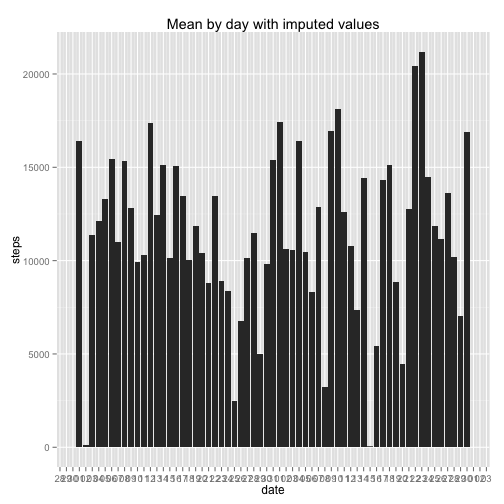

To run this analysis, download the activity.zip file in this repository and unzip the csv file. Set your working directory to the folder with the csv file and you will be able to run this analysis.

This analysis evaluates some data from personal activity monitoring devices.

Part 1: Daily Metrics

Here are the total number of steps taken per day:


```r
# import data, note that missing values = NA
dat <- read.csv("activity.csv",TRUE,sep=",")
# remove NA records
dat <- na.omit(dat)
# convert date field to date
dat$date <- as.Date(dat$date,format="%Y-%m-%d")
# load ggplot
library(ggplot2)
library(scales)
library(dplyr)
library(mice)
# graph by day:
ggplot(data = dat, aes(date, steps)) +
        stat_summary(fun.y = sum, 
                     geom = "bar") + 
        scale_x_date(
                labels = date_format("%d"),
                breaks = "1 day")
```

 

Here are the mean and median steps taken per day, respectively:


```r
        # get mean and median by day
        
        by_day <- group_by(dat,date)
        by_day <- summarise(by_day,sum(steps))
        mean(by_day$`sum(steps)`)
```

```
## [1] 10766.19
```

```r
        median(by_day$`sum(steps)`)
```

```
## [1] 10765
```

Next, we evaluate the average daily steps by interval. 


```r
        # get average steps by 5 minute intervals
        library(dplyr)
        by_day <- group_by(dat,date,interval)
        by_interval <- group_by(by_day,interval)
        by_int <- summarise(by_interval,mean(steps))
        by_int <- rename(by_int,mean_steps=`mean(steps)`)
        plot(by_int$interval, by_int$mean_steps, type="l",xlab=                   "Interval", ylab= "Average Steps / Interval", col="green" , lwd=2)
```

 

The interval with the highest number of average steps is:


```r
        by_int[which.max(by_int$mean_steps),1]
```

```
## Source: local data frame [1 x 1]
## 
##   interval
##      (int)
## 1      835
```

Next, we evaluate what the results might look like if we impute values for the missing data points.

In this data set, we have the following number of missing values:


```r
      dat <- read.csv("activity.csv",TRUE,sep=",")
miss <- is.na(dat$steps)
sum(miss)  
```

```
## [1] 2304
```

We use the mice package to impute the missing values and graph the new average steps per day. The new graph has generally higher values than the original graph. The last bar is a prime example.


```r
        # use mice package to impute missing values using chained equations
        dat2 <- mice(dat)
```

```
## 
##  iter imp variable
##   1   1  steps
##   1   2  steps
##   1   3  steps
##   1   4  steps
##   1   5  steps
##   2   1  steps
##   2   2  steps
##   2   3  steps
##   2   4  steps
##   2   5  steps
##   3   1  steps
##   3   2  steps
##   3   3  steps
##   3   4  steps
##   3   5  steps
##   4   1  steps
##   4   2  steps
##   4   3  steps
##   4   4  steps
##   4   5  steps
##   5   1  steps
##   5   2  steps
##   5   3  steps
##   5   4  steps
##   5   5  steps
```

```r
        dat2<- complete(dat2)
        dat2$date <- as.Date(dat$date,format="%Y-%m-%d")
        ggplot(data = dat2, aes(date, steps)) +
                stat_summary(fun.y = sum, 
                             geom = "bar") + 
                scale_x_date(
                        labels = date_format("%d"),
                        breaks = "1 day") +
                ggtitle("Mean by day with imputed values")
```

 

```r
        by_day <- group_by(dat2,date)
        by_day <- summarise(by_day,sum(steps))
```

Next we look at the new mean and median steps per day with the imputed values. Both the mean and the median values are higher than the original values.


```r
        mean(by_day$`sum(steps)`)
```

```
## [1] 10907.7
```

```r
        median(by_day$`sum(steps)`)  
```

```
## [1] 11162
```

Lastly, we compare the average weekday steps to the average weekend steps by interval. We generally see higher steps during the weekdays at the lower intervals and higher steps during the weekends at the higher intervals, indicating we are more active earlier in the day on weekdays and more active later in the day on weekends.


```r
        dat2$day <- weekdays(dat2$date)
        dat2$daytype <- ifelse (dat2$day=="Saturday" |
                                dat2$day=="Sunday","weekend","weekday")
        by_day <- group_by(dat2,daytype,interval)
        by_day <- summarise(by_day,mean(steps))
        by_day <- rename(by_day,mean_steps=`mean(steps)`)
        qplot(x=interval, y=mean_steps, fill=daytype,
                               data=by_day, geom="bar", stat="identity",
                               position="dodge")
```

 

